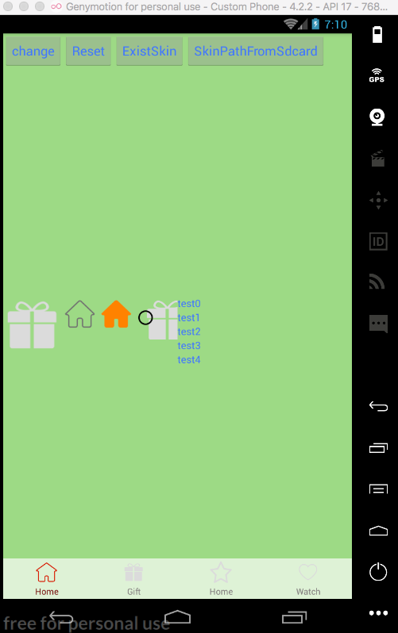
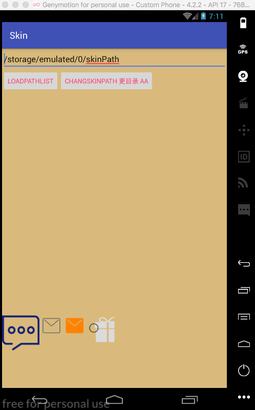

# SkinLib


Change Skin for Andorid and RN


###  USE
 git submodule add https://github.com/wisn-mirror/SkinLib.git /your project/lib

### ScreenShot








## 切换皮肤

```java
 设置指定皮肤
 SkinManager.getInstance().loadSkin("theme-com.wisn.skin2--43-1.0-2017-09-22-04-10-49.skin", new SkinLoaderListener());
恢复默认皮肤
 SkinManager.getInstance().resetDefaultThem();
                                              
```
## 加载皮肤文件

```java
 
 SkinManager.getInstance().saveSkin(String skinFilePath,
                            String skinName)
                                               
```
## 切换皮肤路径

```java
 
 SkinManager.getInstance().updateSkinPath(“皮肤根路径”,new SkinLoaderListener());

                                               
```

## 自定义View换肤：

```java

 DrawableTopAttr  drawableTopAttr=new DrawableTopAttr();
 drawableTopAttr.setRes("drawableTop",attrValueresId);
 dynamicAddView(view,drawableTopAttr);
       
```
## 加载字体文件

```java

SkinManager.getInstance().saveFont("字体路径")     
                                          
```
## 切换字体文件

```java

SkinManager.getInstance().loadFont("字体名称" ,new SkinLoaderListener()))     
                                          
```
##  React Native 本地Module：

```java

 	@ReactMethod
    public void getImage(String StateName, String imageName, Callback callback) {
        LogUtils.e("getImage", "StateName:" + StateName + " imageName:" + imageName);
        WritableMap params = Arguments.createMap();
        String path = SkinManager.getInstance().getPathForRN(imageName);
        params.putString(StateName, path);
        callback.invoke(params);
    }

    @ReactMethod
    public void getImageMap(ReadableMap StateName, Callback callback) {
        WritableMap params = Arguments.createMap();
        ReadableMapKeySetIterator readableMapKeySetIterator = StateName.keySetIterator();
        while (readableMapKeySetIterator.hasNextKey()) {
            String s = readableMapKeySetIterator.nextKey();
            String Name=StateName.getString(s);
            String path = SkinManager.getInstance().getPathForRN(Name);
            LogUtils.e("MainModule", "getImageMap path:" + path + "  name:" + Name+ "  key:" + s);
            params.putString(s, path);
        }
        callback.invoke(params);
    }

    @ReactMethod
    public void getImageList(ReadableArray StateName, Callback callback) {
        WritableMap params = Arguments.createMap();
        for (int i = 0; i < StateName.size(); i++) {
            String string = StateName.getString(i);
            String path = SkinManager.getInstance().getPathForRN(string);
            LogUtils.e("MainModule", "getImageList path:" + path + "  name:" + string);
            params.putString(string, path);
        }
        callback.invoke(params);
    }

    @ReactMethod
    public void getColor(String StateName, String colorName, Callback callback) {
        WritableMap params = Arguments.createMap();
        String path = SkinManager.getInstance().getColorForRN(colorName);
        params.putString(StateName, path);
        callback.invoke(params);
    }

    @ReactMethod
    public void getColorMap(ReadableMap StateName, Callback callback) {
        WritableMap params = Arguments.createMap();
        ReadableMapKeySetIterator readableMapKeySetIterator = StateName.keySetIterator();
        while (readableMapKeySetIterator.hasNextKey()) {
            String s = readableMapKeySetIterator.nextKey();
            String Name=StateName.getString(s);
            String path = SkinManager.getInstance().getColorForRN(Name);
            LogUtils.e("MainModule", "getColorMap path:" + path + "  name:" + Name+ "  key:" + s);
            params.putString(s, path);
        }
        callback.invoke(params);
    }

    @ReactMethod
    public void getColorList(ReadableArray StateName, Callback callback) {
        WritableMap params = Arguments.createMap();
        for (int i = 0; i < StateName.size(); i++) {
            String string = StateName.getString(i);
            String path = SkinManager.getInstance().getColorForRN(string);
            LogUtils.e("MainModule", "getColorList path:" + path + "  name:" + string);
            params.putString(string, path);
        }
        callback.invoke(params);
    }
       
```
##  React Native 通过本地调用换肤 Example

```js
	/**
     * 接收换主题消息后回调的方法
     *
     * @param props
     */
    nativeChangeThem(props){
        super.nativeChangeThem(props);
        MainModule.getColor("primary","primary",(result) =>this.setState(result));
        MainModule.getImage("image","gift_0",(result) =>this.setState(result));
        var a=new Array();
        a.push("primary");
        a.push("colorPrimary");
        a.push("colorPrimaryDark");
        a.push("colorPrimary");
        MainModule.getColorList(a,(result) =>this.setState(result))

        var a=new Array();
        a.push("gift_0");
        a.push("gift_1");
        a.push("colorPrimaryDark");
        a.push("ic_launcher");
        MainModule.getImageList(a,(result) =>this.setState(result))


        var map={};
        map['primary333']="primary";
        map['colorPrimary222']="colorPrimary";
        map['colorPrimaryDark111']="colorPrimaryDark";
        MainModule.getColorMap(map,(result) =>this.setState(result))

        var map={};
        map['primary3rewq33']="gift_0";
        map['coloreePrimaqqqry222']="gift_1";
        map['colorPrimaryDark111']="colorPrimaryDark";
        map['ic_launcher']="ic_launcher";
        MainModule.getImageMap(map,(result) =>this.setState(result))
       
```
......

## License

The MIT License
